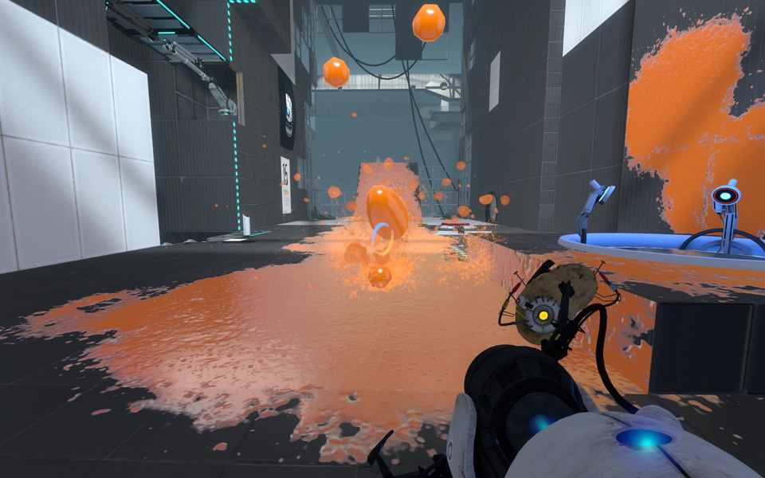

## Project Outline

Developers and designers collaborate to enhance an existing game, originally created during a game jam. The game, titled The Last Drop, is being expanded with additional features and functionality to improve the player experience. Developers work on coding and integrating new mechanics, while designers focus on refining the user interface, visual elements, and overall aesthetic. By combining their expertise, both teams aim to create a more polished and engaging version of the game. The goal is to take the initial game jam concept and transform it into a more complete and playable experience, adding depth and replayability. With the developers focusing on technical improvements and the designers emphasizing user experience, the collaboration between these two roles ensures the game's growth and evolution. The end result will offer players a more immersive and enjoyable gameplay experience, showcasing the potential of *The Last Drop* beyond its original game jam prototype.

The goals and objectives for expanding The Last Drop after its game jam release are centered around enhancing the gameplay experience and refining the game's features. The primary goal is to improve the overall player experience by adding new mechanics, optimizing controls, and enhancing the game’s flow. Developers focus on addressing bugs and performance issues while introducing new content, such as new mechanics, to increase player enjoyability. Designers work on refining the game’s aesthetics, improving visual elements, level design, and ensuring the audio complements the gameplay. Accessibility is also a key goal. The collaboration between developers and designers is crucial for integrating technical improvements with a polished user experience. Performance optimization ensures smooth gameplay on multiple PC. Additionally, the team collects player feedback to guide adjustments and balancing. Ultimately, the objective is to release a more complete and engaging version of The Last Drop, showcasing the potential of the original game jam prototype.

One major challenge during the development of The Last Drop is time management. With the addition of new features, content, and mechanics, there’s a risk that the team may not meet the project’s deadline. The increased scope could lead to the hand in not being the teams vision if the team isn’t careful in managing resources and balancing priorities. Another challenge is communication, both between developers and designers and among developers themselves. Misunderstandings or lack of clear communication can result in mismatched expectations, missed details, or inconsistent implementation of game mechanics and design elements. This could affect the overall quality of the game, as both teams must be aligned in terms of goals and progress. Effective collaboration and regular check-ins will be essential to avoid these issues, ensuring that both technical and design elements come together smoothly. Overcoming these challenges will require careful planning, coordination, and adaptability to ensure the game is completed on time and meets the team's vision.

## Research

For this project, I conducted extensive research on FInterp To node and explored the Unreal Engine to create a more immersive experience. I prioritized studying official documentation to develop my ability to learn new techniques independently and without direct guidance.

Additionally, I used an example of an existing game which is Portal 2 to deepen my understanding of puzzle games mechanics and ensure its proper implementation within the game.

In this project, I studied Henry Jenkins' perspectives on video games as a 'lively art' to enhance my understanding of designing innovative, interactive, and emotionally resonant game experiences.

### Portal 2

Portal 2’s gradual learning curve, physics-based puzzles, and seamless narrative integration will offer valuable insights for The Last Drop. Like Portal 2, The Last Drop will introduce mechanics progressively, ensuring intuitive player learning. Physics-driven interactions, such as bubble growth, will be refined for engaging gameplay. Additionally, Portal 2’s blend of humor and storytelling will enhance immersion, serving as a model for *The Last Drop*. The cooperative aspects of Portal 2 will highlight the importance of communication, mirroring *The Last Drop*’s development challenges, where clear coordination will ensure a cohesive and polished final product.

Portal 2’s development, discussed in GDC talks like Creating a Sequel to a Game That Doesn’t Need One (2012) (Portal 2: Creating a Sequel to a Game That Doesn’t Need One, 2016), showcases Valve’s innovation in evolving gameplay mechanics and storytelling. Similarly, The Last Drop will build upon its game jam roots, refining core mechanics and introducing new elements to increase complexity. Like Portal 2’s use of gels and laser redirection, The Last Drop will evolve its physics interactions. Valve’s blend of humor, narrative, and teamwork in Portal 2 will guide The Last Drop’s approach, ensuring a cohesive, innovative, and immersive player experience.

<iframe width="560" height="315" src="https://www.youtube.com/embed/BYFvwbby2YM?si=Wv3kc8FWwDYVWNtW" title="YouTube video player" frameborder="0" allow="accelerometer; autoplay; clipboard-write; encrypted-media; gyroscope; picture-in-picture; web-share" referrerpolicy="strict-origin-when-cross-origin" allowfullscreen></iframe>

*Video 1*: Portal 2 GDC talk

The insights from *Portal 2*’s design are highly applicable to *The Last Drop*’s development, particularly regarding gameplay mechanics and player engagement. Valve’s method of gradually introducing new mechanics—allowing players to understand and feel competent before adding complexity—aligns with my goal of creating an intuitive learning curve. This approach ensures players stay confident and engaged while progressively increasing the challenge. By prioritizing player experience and gradual progression, I aim to keep players immersed without feeling overwhelmed. These principles guide my decisions on pacing new features, ensuring a steady, rewarding skill development curve for players.

*Photo 1*: Drop Splash Mechanic from Portal 2

### Unreal Engine 5 FInterp To Documentation

The documentation on FInterpTo in Unreal Engine will provide valuable insight into interpolating values, which will be especially relevant for The Last Drop, where smooth transitions will be key to a polished player experience. FInterpTo will allow for gradual movement from a start value to a target value, with inputs including the current value, target value, delta time (for frame rate smoothness), and interpolation speed. In The Last Drop, this will be used to smoothly interpolate the bubble’s size when it collides with water. This will create a natural effect, ensuring that the bubble grows and shrinks gradually and responsively. It will enhance puzzle-solving by providing consistent visual feedback, making player actions more intuitive. Interpolating the bubble’s size will ensure smooth, continuous transitions rather than abrupt changes, contributing to a polished mechanic and a more engaging, immersive player experience.

The technical knowledge from the FInterpTo documentation will support my project work on The Last Drop by providing a method for creating smooth, responsive transitions, particularly with the bubble growth and shrinkage mechanic. By applying FInterpTo, I will ensure the bubble's size changes gradually and naturally when it collides with water, making the transition feel more polished and visually appealing. This will enhance the puzzle-solving experience by making player actions more intuitive and engaging. The knowledge will guide my decision-making by offering a tool to fine-tune the speed and smoothness of these transitions, ensuring they align with the overall aesthetic and gameplay goals. Using FInterpTo will contribute to a more fluid and immersive player experience, improving gameplay clarity, visual feedback, and player satisfaction. It will help create a seamless, polished interaction that strengthens the core mechanics of the game.

*Photo 2*: FInterpTo Node

### Academic Source

In his essay "Games, the New Lively Art," Henry Jenkins asserts that video games will emerge as a significant art form in the digital era, paralleling the recognition that cinema and jazz received during the machine age. He observes that games "open up new aesthetic experiences" (Jenkins, 2007, p. 23), transforming the computer screen into a platform for accessible experimentation and innovation. This perspective underscores the potential of video games to serve as dynamic art forms, engaging players in unique and meaningful ways. Applying Jenkins' insights to the development of The Last Drop, a game initially created during a game jam, highlights the importance of leveraging the unique capabilities of the gaming medium. The collaboration between developers and designers to introduce new mechanics, refine visual elements, and enhance the overall player experience embodies the spirit of experimentation and innovation that Jenkins emphasizes. By embracing the "limitless plasticity" (Jenkins, 2007, p. 39) of video games, the team will craft novel environments and interactions that captivate and immerse players. Jenkins also cautions against merely transplanting cinematic techniques into games, arguing that such practices can lead to products "lacking meaningful gameplay" (Jenkins, 2007, p. 39). This insight is particularly relevant for The Last Drop team, emphasizing the need to focus on interactive elements that distinguish games from other media. By recognizing and harnessing the distinct properties of video games, the developers and designers will create an experience that is both innovative and emotionally resonant. This approach will not only enhance the overall player experience but also align with the broader recognition of games as a legitimate and impactful art form in contemporary culture.

## Impleamentation

### BP Spinning Actor

#### Initial Blueprint

<iframe width="560" height="315" src="https://blueprintue.com/render/3843iie5/" scrolling="no" allowfullscreen></iframe>

This blueprint rotates a static mesh over time. The Event BeginPlay node starts a Delay before calling Start Spin. Start Spin sets a looping timer (Set Timer by Event) to run the spin logic every 6 seconds. The rotation logic gets the mesh’s current relative rotation and modifies it using Lerp (Rotator) to interpolate between the current and target rotation (90-degree roll adjustment). SetRelativeRotation applies the update. A timeline named Spin manages animation, ensuring a gradual transition rather than an abrupt movement, creating a smooth and continuous spinning effect.

#### Actor Component

<iframe width="560" height="315" src="https://blueprintue.com/render/i6g12nxs/" scrolling="no" allowfullscreen></iframe>

This blueprint improves rotation handling with a structured, modular approach. Instead of modifying rotation in a single event, it uses a collapsed node for dynamic calculations. This node takes input parameters (rotation axes, time, and multipliers) and outputs refined values, enhancing interpolation control. The main event graph calls this function to compute new rotation values before applying them via SetActorRotation, ensuring smoother transformations. Compared to the first blueprint, this design enhances reusability, maintainability, and scalability, making it easier to adjust rotational behavior without modifying core logic.

### Bubble Size Change

#### Growth Function

<iframe width="560" height="315" src="https://blueprintue.com/render/5ng9to-u/" scrolling="no" allowfullscreen></iframe>

This function manages bubble growth using "Water Amount." The "Growth" function adds it to "Current Size" and updates it with a SET node. If "Current Size" meets or exceeds "Max Size," it is clamped using another SET node, preventing overexpansion while allowing dynamic growth in response to game interactions. This ensures controlled and realistic size changes.

#### Shrink Function

<iframe width="560" height="315" src="https://blueprintue.com/render/q0y2cgzq/" scrolling="no" allowfullscreen></iframe>

This function manages bubble shrinking based on size and water amount. The "Shrink" function checks if "Current Size" is below "Max Size." If true, it reduces "Current Size" using "Water Amount" and updates it. A second check ensures it doesn’t fall below "Min Size," clamping if necessary. This prevents excessive shrinking while maintaining controlled, dynamic size changes.

#### Growth Shrink Logic

<iframe width="560" height="315" src="https://blueprintue.com/render/w96ui2nl/" scrolling="no" allowfullscreen></iframe>

This mechanic updates every frame using Event Tick, storing Delta Seconds for size changes in the "GrowthShrink" node. A Branch checks if the object is in water, triggering the Growth or Shrink function based on the condition. Lerp nodes handle smooth scaling transitions, and FInterp To interpolates the sphere’s scale, adjusting it dynamically based on water interaction for consistent, fluid transformations.

### Testing

Once I completed development on the mechanic, I shifted my focus to thoroughly testing it to ensure that it functioned correctly and delivered a smooth, consistent experience. I began by running tests directly within the editor, which allowed me to observe the mechanic’s behavior in a controlled setting and pinpoint any bugs or unintended outcomes. This phase was critical for identifying issues early, before the mechanic was integrated into broader gameplay. I paid close attention to how it interacted with other systems, assets, and variables, making sure it behaved as expected in a variety of situations. During this testing process, I made a series of iterative adjustments. Some were small, like tweaking numerical values or collision settings, while others involved reworking logic or reorganizing scripts to improve reliability and performance. I approached the mechanic not just from a technical standpoint, but also from a player’s perspective—constantly asking whether it felt intuitive, engaging, and satisfying to use. I considered how it contributed to the overall flow and balance of the game, ensuring that it supported the intended gameplay experience. After each revision, I retested thoroughly, confirming that fixes worked and that no new problems were introduced. This cycle of testing and refinement was repeated multiple times until I reached a version of the mechanic that was both stable and enjoyable to use. By taking a careful, iterative approach, I was able to polish the mechanic into a fully functional feature, ready for integration into the complete game. The end result was a system that worked seamlessly and elevated the quality of the gameplay as a whole.

### Technical Difficulties

I assisted a designer in pushing their work and the rive plugin to the GitHub main branch. When they initially pushed their work to main, it caused their changes to be deleted. To prevent this from happening, I carefully removed the conflicting changes before pushing their work to the main branch. Additionally, I addressed an issue with player spawning in the main menu by replacing the player character with a temporary player pawn specifically for the main menu level. This temporary pawn poses the player, which successfully resolved the spawning issue. Furthermore, I tackled a problem with the mouse glitching out on UI buttons. To fix this, I connected the right thumbstick axis from the gamepad and checked if the current level wasn’t the main menu. If it wasn’t, I ensured that the mouse position was set correctly, which eliminated the glitch. By performing these tasks, I was able to help stabilize the project, ensuring that both the player's experience and the designer's workflow were smooth. These fixes significantly improved the game's functionality, allowing the project to move forward without the issues that had been previously hindering it.

## Outcome

## Reflection

### Research Effectiveness

The research conducted significantly enhanced *The Last Drop* by refining technical mechanics, gameplay design, and artistic direction. Studying FInterpTo allowed for smoother transitions, particularly with bubble mechanics, improving fluidity. Insights from Portal 2 guided the development of an intuitive learning curve, ensuring players were engaged without feeling overwhelmed. Henry Jenkins’ perspective on video games as a unique, emotionally resonant art form enriched the design, helping to deepen player engagement and elevate the narrative. The Unreal Engine FInterpTo documentation and Portal 2’s design philosophy had the most significant impact on the project, directly influencing both technical implementation and gameplay structure. A research gap in the project lies in user testing for gameplay flow, accessibility design, and performance optimization, as well as improving collaborative workflows.

### Positive Analysis

Working in a massive team provided me with valuable experiences that will undoubtedly help me in the future. Being part of such a large team allowed me to collaborate with individuals, each bringing their unique skills and perspectives to the table. I quickly learned the importance of effective communication, as working with so many people required constant coordination and clear discussions. I gained an understanding of how to work within a structured environment, where tasks were divided, deadlines were tight, and teamwork was essential for success. I learned how to balance individual responsibilities with team objectives, ensuring that my work contributed to the overall goals of the group. This experience also taught me the significance of adaptability; in a large team, priorities and tasks often shift, so being able to adjust and remain flexible was crucial. Additionally, I developed strong problem-solving skills, as collaborating with such a diverse group often meant coming across new challenges that required creative solutions. Through regular feedback and constructive criticism, I became more proficient in my role and learned how to manage the dynamics of a large team effectively. The exposure to different working styles, perspectives, and problem-solving approaches was invaluable. All of these lessons and skills will undoubtedly be beneficial as I move forward in my career, helping me to work efficiently in future collaborative environments and contribute effectively to any team I am a part of. Overall, the experience of working in a massive team has been a significant step in my personal and professional growth.

### Negative Analysis

The project coordination and communication on the team were poorly managed, which led to several challenges throughout the process. There was a lack of clarity regarding roles and responsibilities, which caused confusion about who was responsible for what tasks. This often resulted in duplicated efforts or, in some cases, critical tasks being overlooked entirely. Deadlines were frequently missed, and there was little follow-up to ensure that everyone was on track. Without a clear communication structure in place, important updates and decisions were not shared efficiently, leaving team members in the dark about project progress or changes in direction. This lack of transparency caused frustration, as team members were not always aware of what others were working on or the status of key deliverables. In some instances, important feedback or requests from stakeholders were not communicated in a timely manner, leading to last-minute rushes to meet expectations. Additionally, the project management tools that were in place were underutilized, and there was no consistent process for tracking progress or addressing issues as they arose. As a result, the team struggled to stay organized and on schedule. This poor coordination and communication negatively impacted the overall efficiency and quality of the project, as issues were often discovered too late in the process to be addressed effectively. The experience highlighted the importance of strong communication channels, clear role definition, and efficient project management systems. Moving forward, I realized how critical these aspects are to the success of any project, and how their absence can lead to unnecessary delays and frustration within the team.

### Next Time

If I were to undertake a similar project again, I would integrate more C++ into programming the game mechanics for greater control and efficiency. I would focus on using C++ for core systems and performance-critical features, such as physics and AI, to optimize the game's performance. Planning the game architecture with C++ in mind from the start would allow better management of complex systems, and the ability to handle low-level operations more effectively. I’d improve communication between C++ and Blueprint to maintain flexibility while benefiting from both approaches. Additionally, leveraging Unreal Engine’s C++ capabilities for smart pointers and memory management would create more scalable systems. Designing modular and reusable C++ code would also ensure smooth development for future projects.

## Bibliography

Porrtal 2 (PC (Steam)) (2011) Developed and published by Valve

Portal 2: Creating a Sequel to a Game That Doesn’t Need One (2016) At: https://www.youtube.com/watch?v=BYFvwbby2YM

FInterp To | Unreal Engine 5.5 Documentation | Epic Developer Community (s.d.) At: https://dev.epicgames.com/documentation/en-us/unreal-engine/BlueprintAPI/Math/Interpolation/FInterpTo

Henry Jenkins (2007). The WOW Climax: Tracing the emotional impact of popular culture, New York: NY, New York University.